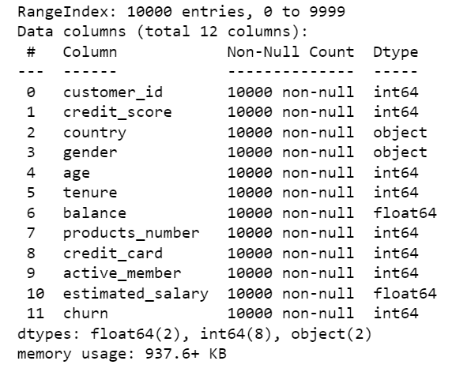

If your retention is poor nothing else matters! 
## Predicting Banking Customer Churn

## Overview:
- Elevator Pitch
- Business Understanding
- Data Understanding
- Modeling & Evaluation
- Conclusion
- Repository Navigation

## Elevator Pitch:
Financial institutions and businesses such as banks that provide banking services have to worry about the problem of ‘Churn’ i.e., customers leaving and joining an alternate service provider. This project examines churn prediction of customers in the banking sector using a unique 10,000 point customer-level dataset from ABS multistate bank. The most effective churn predictive model was that of the random forests, which produced a prediction accuracy of 86.3%. The variables of age, products_number, and balance had the most significant predictive potential of a client's propensity to churn. 

## Business Understanding:
Bank executives worldwide have recognized the importance of increasing customer satisfaction. As customers use new technologies in other areas of their lives, their expectations for banking services increases as well. In the next three years, 66.8% of existing banking clients plan to or have already utilized a bank account from a non-traditional business (big tech or fintech), according to the World Retail Banking Report of 2022. This scenario of distinct competition makes it harder for traditional banks to hold onto their current customer base.

Customer churn, also known as customer attrition, refers to when clients or subscribers stop using a business or service. Every churn has a direct impact on company operations (revenues, costs, profit, etc.)The cost of acquiring new customers often costs more than retaining existing ones.There exist a myriad of conditions that attribute to customer churn, and thus it is advantageous for banks and financial insitutions to know what leads a client towards the decision to leave the insitution. Banking Businesses can take proactive action in this way to establish long-term relationships with customers and maximize the value of their customer base. 

This project engages in churn predictive modeling. A churn analysis would be beneficial to the stakeholder as it would allow them to analyze which features amongst the sample set are directly contributing to customer churn, so that they may target those features accordingly.

## Data Understanding
The Bank Customer Churn dataset was obtained from Kaggle. It is stored in a CSV file, titled ‘Bank Customer Churn Dataset’. The dataset contains 10,000 sample points of account holders at ABS Multistate Bank. The dataset is relevant for this project as it contains unique customer-level datapoints from a banking institution. The dataset contains no missing values. 

The dataset contains 12 distinct features (data columns) those being:

'Churn' is used as the target variable. In the dataset, churn is equivalent to 1 if the client has left the bank during some period or 0 if he/she has not churned.

## Modeling and Evaluation
Statistical and data mining techniques were used to create the prediction models. The Classification toold are used to model and predict customer churn were decision trees and random forests. The decision tree served as the baseline model, which produced a prediction accuracy of 78.5%. The improved random forests model produced a prediction accuracy of 86.3%. The improved model was 7.8% more accurate than the baseline. Additionally, I utilized Grid Search, a method for performing hyper-parameter optimisation, with both models and the test data set. The output generated the optimal combination of hyper-parameters for each model and improved the results. The output revealed that the hyperparameters of max_depth=15, min_samples_split=10, random_state=42 within the Random Forests model were the most optimal and would result in the most accurate predictions. 

## Conclusion:
The deployed model can be used by the stakeholder to produce valuable and relevant business insights, such as which customers are most likely to leave, which regions/attributes are linked to high (and low) risk of churn, as well as the overall distribution of current customers and their likelihoods of leaving. The stakeholder may quantify the effectiveness of the model by calculating the percent change in the overall churn rate before and after model deployment. 

The stakeholder at hand, ABC Multistate Bank, should utilize the Random Forest ML model as it provided a higher accuracy of prediction (86.3%) compared to Decision Trees (78.5%). With the availability of this Random Forest model, it is possible to predict the possiblity of churn with respect to any customer. The model may be used by the stakeholder to help the firm allocate specific firm resources, develop customer loyalty programs, as well as retention campaigns to retain as many customers as possible. 

## Repo Structure and Navigation:

The ai_capstone_seerat repository contains the following folders/files:

README.md file- "home page" of the capstone project 
'Seerat M. Capstone Project Proposal Template.docx' file- completed proposal template submitted at the start of the project
'Bank Churn Data' Folder- This folder contains the 'Bank Customer Churn Prediction.csv' file, the dataset used for this project
'AI Academy Apprenticeship Capstone Presentation.pdf' file- presents findings in a non-technical presentation format
'index.ipynb'- final version of a Jupyter Notebook (index.ipynb) containing the code implemented for the purposes of this project
'Images' folder- contains images placed in the README.md file

Final Jupyter Notebook: https://github.com/smutneja1/ai_capstone_seerat/blob/master/index.ipynb
Presendation PDF: 

The dataset was downloaded from Kaggle at https://www.kaggle.com/datasets/gauravtopre/bank-customer-churn-dataset in a .CSV file format. 

The following libraries were imported into the jyputer notebook (index.ipynb):

pandas
numpy
matplotlib.pyplot
seaborn

sklearn.model_selection
sklearn.tree
sklearn.metrics
sklearn.preprocessing
sklearn.linear_model
sklearn.ensemble

Follow the code logic and relevant comments in the notebook to re-produce the project from start to end. 

Note* When splitting the data into training and testing dataset, it is important to set random_state = 42. This insures that the random process will output the same result every time, which makes code reproducible. 

